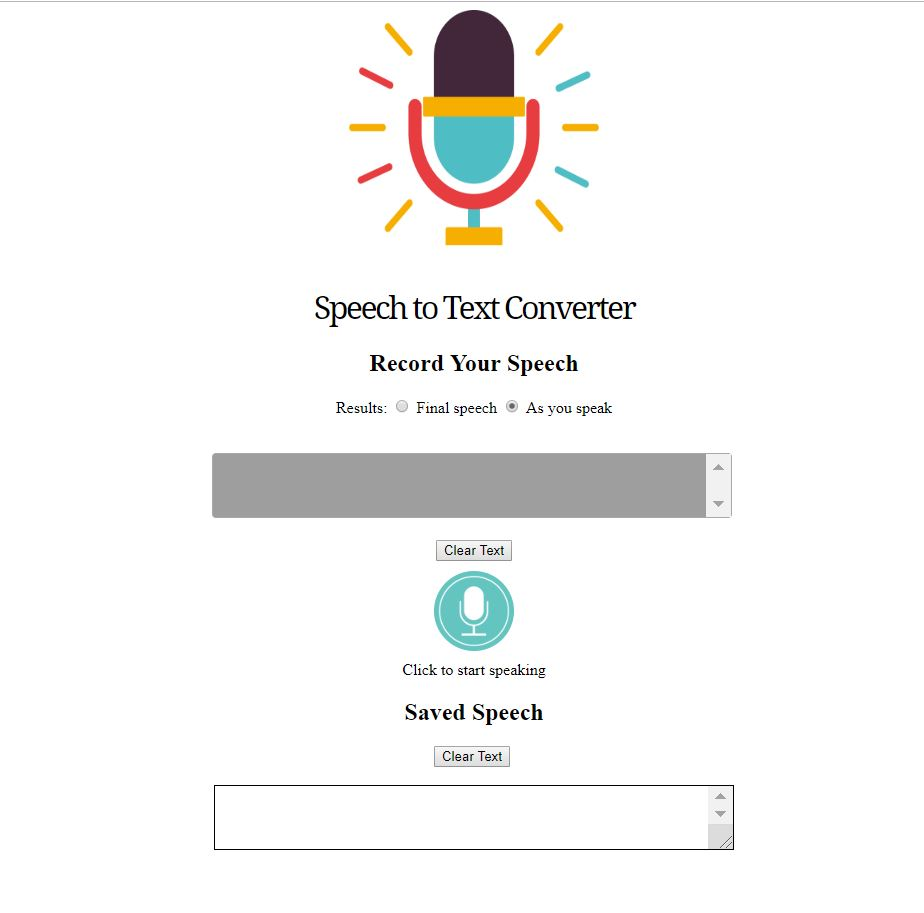
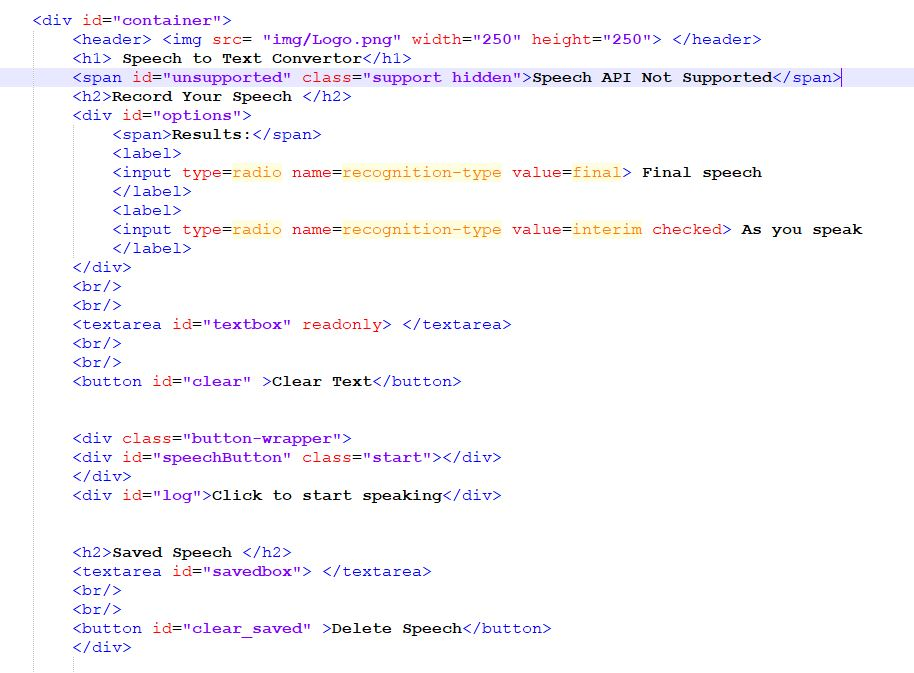
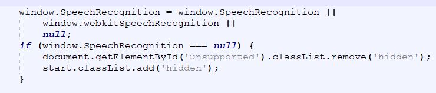
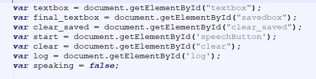
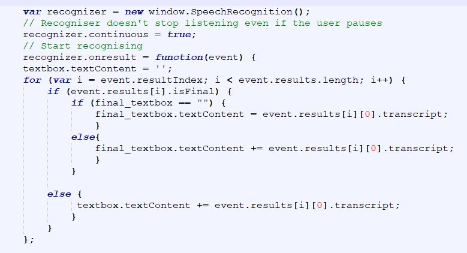

<h1> Creating a Speech to Text Converter Website</h1> 

This is the documentation on how I create a basic tool that can convert speech to text. The final website can be seen in the file "tool.html". The basic feature of the website are below :

<ul>
  <li>The user is able to turn the tool on or off </li>
  <li> The user is able to have 2 options to select from : convert while you speak and convert after you speak</li>
  <li> The user is able to save the speech that they have created into a permanent box </li>
</ul>

 The picture below shows the final website that was created. 
 
 Figure 1 - Website 
 

<h2> Step 1 - Create the Layout - HTML/CSS </h2> 

I first created a simple layout with one container and all further tools added within that container. The full Html code can be found in the file tool.html and the CSS code can be found in the file "style.css".   

Figure 2 - Simple HTML Structure 

<h2> Step 2 - Create the Non Supporting Warning </h2> 

The tools that I used to help recognise the speech is the SpeechRecognition Web Speech API. However, this API is not supported by some browsers, therefore a script had to be created to inform the user whether their browser is able to support the API. 

The script below checks to see if the browser is able to add the SpeechRecognition object and if it can not, then the Javascript will remove the "hidden" tag from the CSS of the hidden container and so show the warning that was created in the html layout.

Figure 3 - Support Javascript

<h2> Step 3 - Getting all Variables from the Html Form </h2>

I then pulled all the variables from the HTML form into to Javascript by using the script below. 

<h2> Step 4 -Convert the Speech to text </h2> 

Once the browser support has been established, the SpeechRecognition object is then added to a variable. The continuous property is added so that continuous results are returned rather than a single result. Then a function is added that will be called when an speech event has been recognised. This function will then add each speech elements to the textbox variable.  
 

<h2> Step 5 -Convert the Speech to text </h2> 
